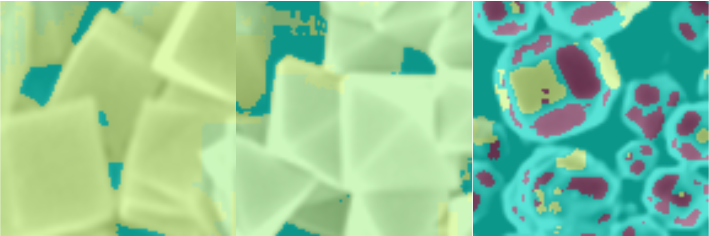

# CS230-Microcrystal-Facet-Segmentation
Microcrystal facet segmentation algorithm based on U-NET architecture.

## Table of contents
* [General info](#general-info)
* [Screenshots](#screenshots)
* [Technologies](#technologies)
* [Setup](#setup)
* [Features](#features)
* [Status](#status)
* [Inspiration](#inspiration)
* [Contact](#contact)

## General info
The goal of this project is to build an appropriate CNN architecture that is able to perform semantic segmentation of nanocrystal facets. 

## Model
keras implementation (https://github.com/divamgupta/image-segmentation-keras/)
## Screenshots


## Technologies
* python - version 3.6
* keras - version 2.0
* python_opencv - version 3.0
* keras_segmentation - version
* Augmentor - version 3.0

## Setup
Describe how to install / setup your local environement / add link to demo version.

## Code Examples
Show examples of usage:
```
from keras_segmentation.models.unet import unet_mini, vgg_unet, mobilenet_unet, 
unet

model = unet_mini(n_classes=96,  input_height=96, input_width=96  )

model.train(
    train_images = "MAR18/train/",
    train_annotations = "MAR18/train_labels/",
    checkpoints_path = "MAR18/checkpoints_MAR18_unet_mini_b8",
    val_images = "MAR18/test/",
    val_annotations = "MAR18/test_labels/",
    epochs=50, validate=True, batch_size=8, 
    optimizer_name="adam",
    gen_use_multiprocessing=True,
    auto_resume_checkpoint=False,
    val_batch_size=2,
)
```

## Features
List of features ready and TODOs for future development
* Awesome feature 1
* Awesome feature 2
* Awesome feature 3

To-do list:
* Wow improvement to be done 1
* Wow improvement to be done 2

## Status
Project is: _in progress_, _finished_, _no longer continue_ and why?

## Inspiration
Add here credits. Project inspired by..., based on...

## Contact
Created by [@flynerdpl](https://www.flynerd.pl/) - feel free to contact me!
